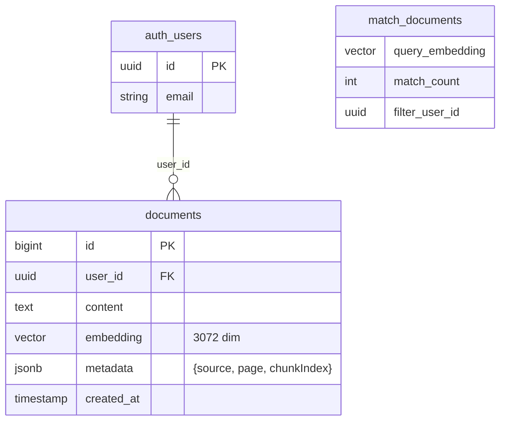

```mermaid
erDiagram
    auth_users ||--o{ documents : "user_id"
    auth_users {
        uuid id PK
        string email
    }
    documents {
        bigint id PK
        uuid user_id FK
        text content
        vector embedding "3072 dim"
        jsonb metadata "{source, page, chunkIndex}"
        timestamp created_at
    }

    %% RPC function
    match_documents {
        vector query_embedding
        int match_count
        uuid filter_user_id
    }
```
