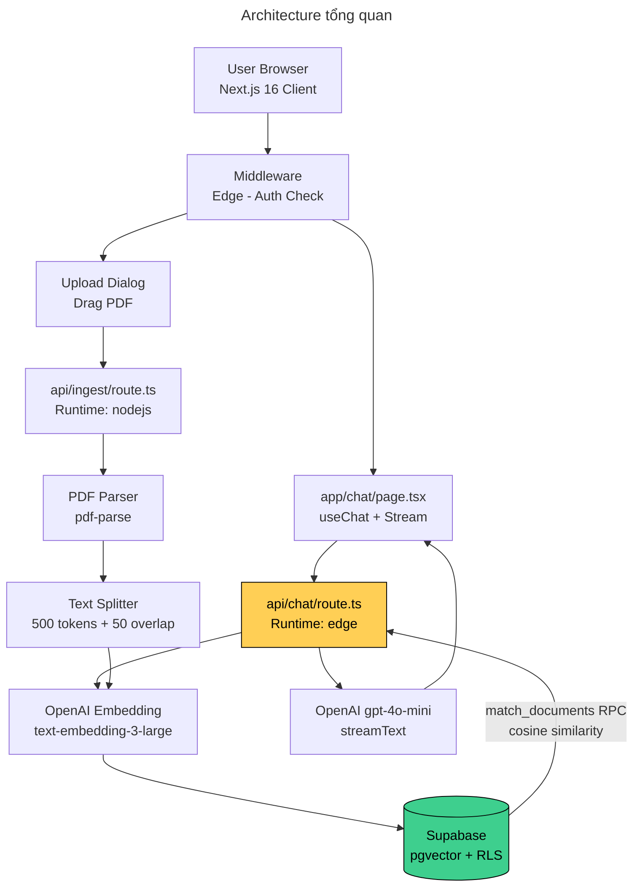

```mermaid
---
title: Architecture tổng quan
---
graph TB
User[User Browser<br/>Next.js 16 Client] --> Middleware[Middleware<br/>Edge - Auth Check]
Middleware --> ChatPage[app/chat/page.tsx<br/>useChat + Stream]
Middleware --> UploadPage[Upload Dialog<br/>Drag PDF]

    ChatPage --> APIChat[api/chat/route.ts<br/>Runtime: edge]
    UploadPage --> APIIngest[api/ingest/route.ts<br/>Runtime: nodejs]

    APIChat --> Embed[OpenAI Embedding<br/>text-embedding-3-large]
    APIIngest --> PDFParse[PDF Parser<br/>pdf-parse]
    PDFParse --> Splitter[Text Splitter<br/>500 tokens + 50 overlap]
    Splitter --> Embed

    Embed --> Supabase[(Supabase<br/>pgvector + RLS)]
    Supabase -->|match_documents RPC<br/>cosine similarity| APIChat

    APIChat --> LLM[OpenAI gpt-4o-mini<br/>streamText]
    LLM --> ChatPage

    style Supabase fill:#3ecf8e,stroke:#000,color:#000
    style APIChat fill:#ffcf55,stroke:#000,color:#000
```
