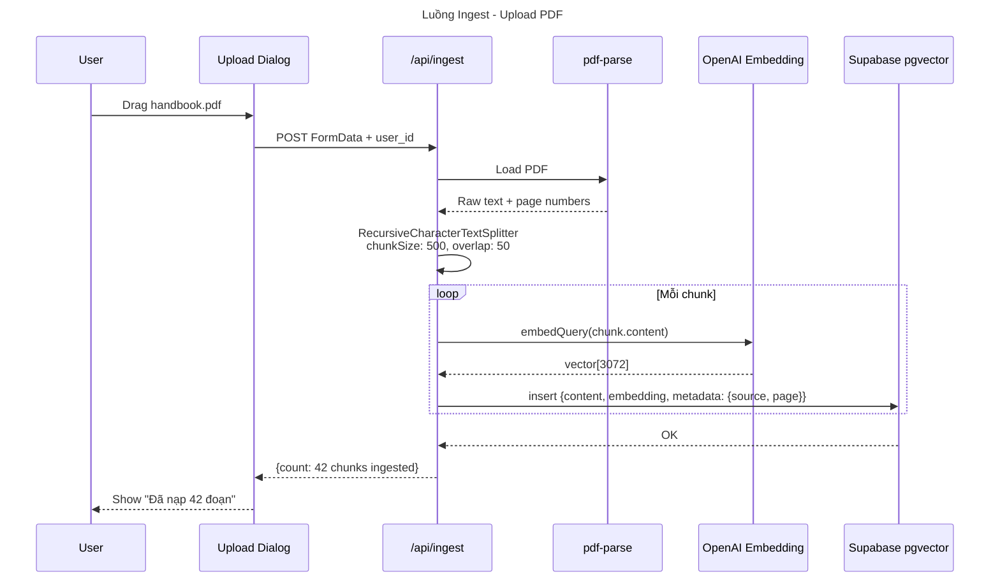

```mermaid
---
title: Luồng Ingest - Upload PDF
---
sequenceDiagram
    participant U as User
    participant FE as Upload Dialog
    participant API as /api/ingest
    participant PDF as pdf-parse
    participant EMB as OpenAI Embedding
    participant DB as Supabase pgvector

    U->>FE: Drag handbook.pdf
    FE->>API: POST FormData + user_id
    API->>PDF: Load PDF
    PDF-->>API: Raw text + page numbers
    API->>API: RecursiveCharacterTextSplitter<br/>chunkSize: 500, overlap: 50
    loop Mỗi chunk
        API->>EMB: embedQuery(chunk.content)
        EMB-->>API: vector[3072]
        API->>DB: insert {content, embedding, metadata: {source, page}}
    end
    DB-->>API: OK
    API-->>FE: {count: 42 chunks ingested}
    FE-->>U: Show "Đã nạp 42 đoạn"
```
