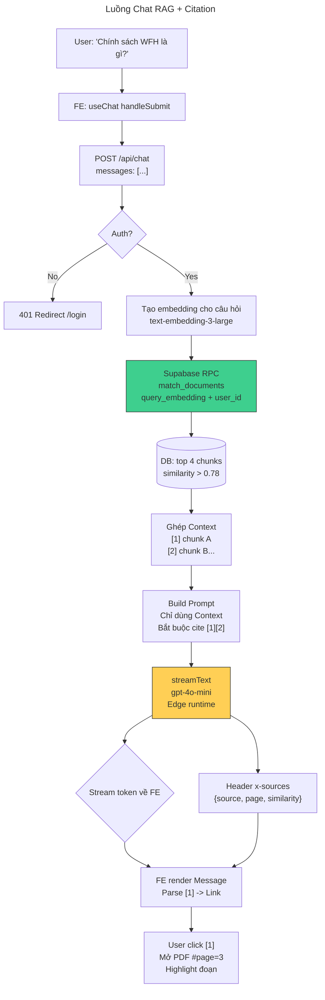

```mermaid
---
title: Luồng Chat RAG + Citation
---

flowchart TD
A[User: 'Chính sách WFH là gì?'] --> B[FE: useChat handleSubmit]
B --> C["POST /api/chat<br/>messages: [...]"]

    C --> D{Auth?}
    D -- No --> E[401 Redirect /login]
    D -- Yes --> F["Tạo embedding cho câu hỏi<br/>text-embedding-3-large"]

    F --> G[Supabase RPC<br/>match_documents<br/>query_embedding + user_id]
    G --> H[(DB: top 4 chunks<br/>similarity > 0.78)]

    H --> I["Ghép Context<br/>[1] chunk A<br/>[2] chunk B..."]
    I --> J["Build Prompt<br/>Chỉ dùng Context<br/>Bắt buộc cite [1][2]"]

    J --> K["streamText<br/>gpt-4o-mini<br/>Edge runtime"]
    K --> L{Stream token về FE}

    L --> M["FE render Message<br/>Parse [1] -> Link"]
    M --> N["User click [1]<br/>Mở PDF #page=3<br/>Highlight đoạn"]

    K --> O["Header x-sources<br/>{source, page, similarity}"]
    O --> M

    style G fill:#3ecf8e,stroke:#333
    style K fill:#ffcf55,stroke:#333
```
